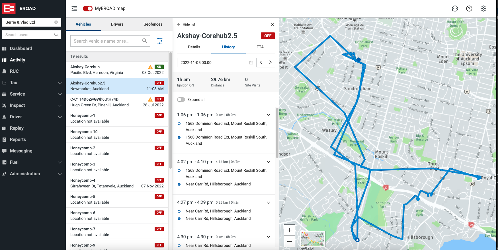

## Feedback on projects
### Third Party event ingestion
- Generic event adapter is the hub of third party event ingestion
  - Upgraded to RXjava for parallelism
  - Moved from Hystrix to R4J
  - Upgraded JedisPool for REDIS
  - Dynamo DB tables now keyed by device serial
  - TODD: Move tables to Dynamic Dynamo DB
- Remove serial prefix from Digital Matter devices
  - Limitations in dispatch software prevented Digital Matter devices to be shipped
  - coordinated effort Between Telematics, Provisioning and Warehouse to remove prefix and rename all makes
- ECP Event ingestion
  - Consuming event from Corehub
  - Data validation and testing
  - Additional data element setting for event types.

| [<< Previous](https://github.com/gerrievisagie/FY23Q3_PDE_SHOW_AND_TELL/blob/main/4.md) | [Next > >](https://github.com/gerrievisagie/FY23Q3_PDE_SHOW_AND_TELL/blob/main/6.md) |
|-----------------------------------------------------------------------------------------|--------------------------------------------------------------------------------------| 
