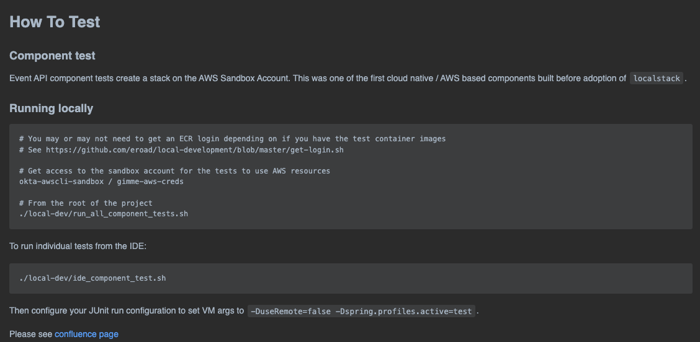

## Feedback on projects
### Upgrade event-api component tests
- Event api component test executed by shell script running maven, pulling ecr image and running docker.
- Mark and Andrew reworked tests to use localstack, docker and MockWebserver to run locally.
- Tests now executes quicker and stabler and are easier to expand and modify.

### Old Readme detailing how to run

| [<< Previous](https://github.com/gerrievisagie/FY23Q3_PDE_SHOW_AND_TELL/blob/main/5.md) | [Next > >](https://github.com/gerrievisagie/FY23Q3_PDE_SHOW_AND_TELL/blob/main/7.md) |
|-----------------------------------------------------------------------------------------|--------------------------------------------------------------------------------------| 
