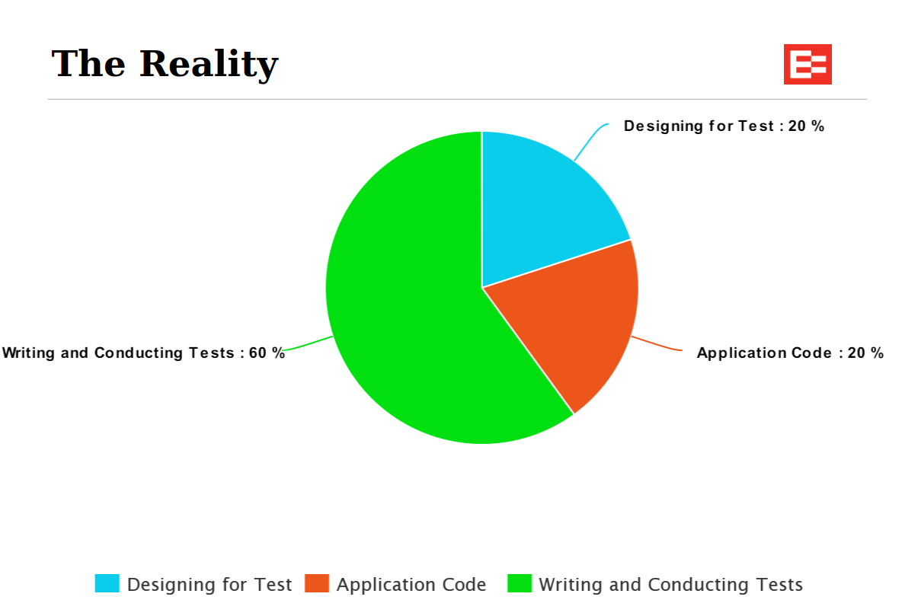
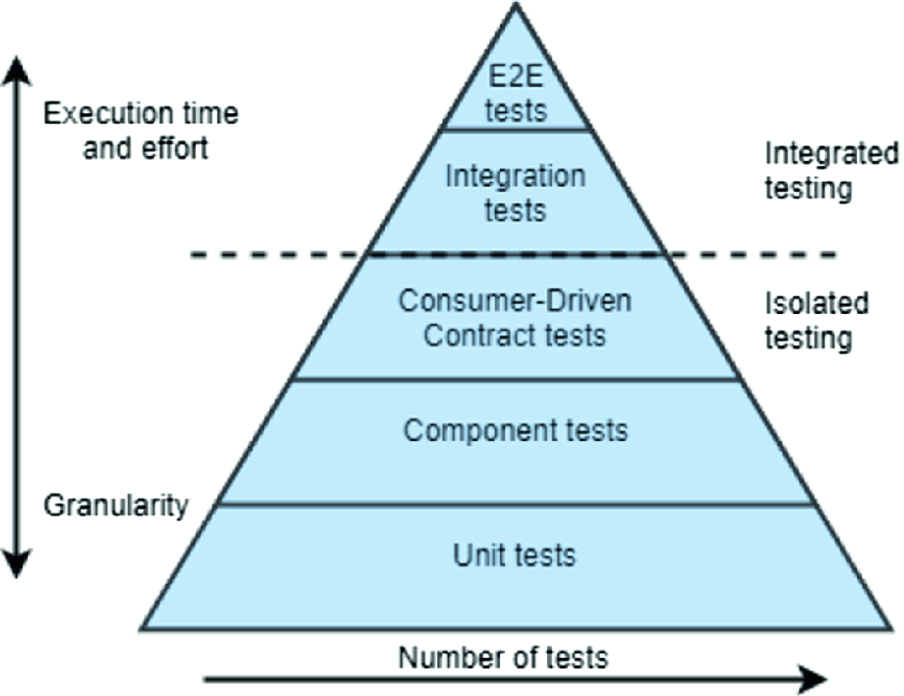

## Our secret weapon - Component Testing

- How do you know the unit tested change has not impacted other parts of the component?
- The regression testing cycle can be long (build, deploy, run test)
### Enter component test!

- Different from units test that mock dependencies and only tests a specific subsection of the code
- Component tests executes the code in a micro environment and tests end-to-end on a component level.
- Automated along with other tests to execute on each maven verify.
    - Can also be run individually
- Shortens the development cycle for integration testing and improves confidence in deploying changes
### Examples
- [Event-Api](https://github.com/eroad/event-api)
- [Generic Event Adapter](https://github.com/eroad/generic-event-adapter)
### Examples
- [Test Scenarios](https://confluence.eroad.io/display/ENG/Event+Tea=m+Presentations?preview=/39226151/56133844/EROAD%20Test%20Scenarios%20June%202018%20(3).pptx#EventTeamPresentations-June2018-TestScenarios)
- [API Testing Overview](https://confluence.eroad.io/pages/viewpage.action?spaceKey=QUAL&title=%5Bknow%5D+Test+Automation+-+API+Testing+Overview)

| [<< Previous](https://github.com/gerrievisagie/FY23Q3_PDE_SHOW_AND_TELL/blob/main/6.md) |
|-----------------------------------------------------------------------------------------|
